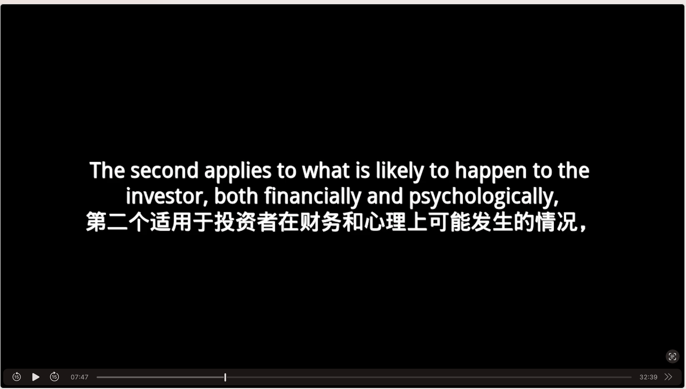

# Audio book to mp4 with text
This project is intended to convert a audio book mp3 to a mp4 file with subtitle as video.

The result mp4 will looks like:


## How to use
1. Register Azure and get the speech recognition key and translator key. Follow:
  - [Create a speech resource](https://portal.azure.com/#create/Microsoft.CognitiveServicesSpeechServices)
  - Get the Speech resource key and region. After your Speech resource is deployed, select Go to resource to view and manage keys. For more information about Cognitive Services resources, see [Get the keys for your resource](https://learn.microsoft.com/en-us/azure/cognitive-services/cognitive-services-apis-create-account#get-the-keys-for-your-resource).
  - [Get a translator key](https://learn.microsoft.com/en-us/azure/cognitive-services/translator/quickstart-translator?tabs=csharp)
2. Run docker:
```
docker build -t audio_book .
docker run -e SPEECH_KEY=xxx -e SPEECH_REGION=xxx -e TRANSLATOR_KEY=xxx -e TRANSLATOR_REGION  -d -v $(pwd):/data audio_book ./run.sh
```

## How does the project works?
1. The run.sh will scan the `./input` directory for mp3 file, then foreach file, it will do the following process.
2. The `captioning.py` will be called and mp3 file will be uploaded to azure to recognize the subtitle. The subtitle srt file will be saved to `output` directory.
3. The `translate.py` will load the srt and send to azure to translate it to chinese and append to the `-ch.srt` file in `output` directory.
4. The `generate_video.py` will load the mp3 file and srt file, and use moviepy library to generate a mp4 in `output` directory.